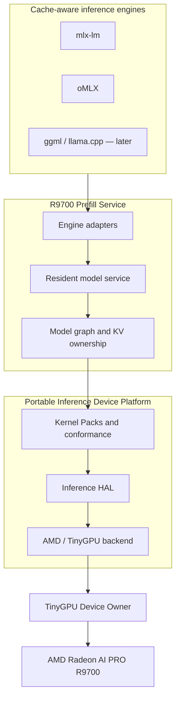

# Architecture

This document defines durable product and system boundaries. Implementation contracts live in `DESIGN.md`. Capability sequencing lives in `ROADMAP.md`. Project language lives in `../CONTEXT.md`. Upstream reuse guidance lives in `REFERENCES.md`.

## Purpose

Turn the accepted native R9700 prefill proof into two durable products:

1. a fast, persistent **R9700 Prefill Service** for cache-aware inference engines; and
2. a reusable **Portable Inference Device Platform** for local inference workloads on non-Metal devices.

The products are co-equal. They share hardware, kernel, conformance, and evidence foundations but advance on independent tracks. Neither product may claim the other's capability without passing an explicit integration gate.

## Documentation contract

- `CONTEXT.md` defines canonical terms only.
- This document states ownership, boundaries, invariants, and target structure.
- `DESIGN.md` specifies implementation-facing interfaces and validation contracts.
- `ROADMAP.md` sequences capability outcomes and promotion gates.
- `IMPLEMENTATION_PLAN.md` describes high-level execution workstreams; task packets remain separate.
- `REFERENCES.md` and `upstream-reference-manifest.yaml` classify and pin upstream guidance.
- `docs/adr/` records hard-to-reverse decisions and rejected alternatives.

## Product/system boundary

### R9700 Prefill Service

Owns:

- resident model identity, preparation, and lifetime;
- prefill request scheduling and model-forward execution;
- authoritative KV state until handoff;
- canonical KV metadata and prompt-cache artifacts;
- per-request evidence, timing, and fail-closed results.

Does not own:

- Apple Metal decode, sampling, or application request policy;
- arbitrary remote/distributed KV transport;
- a universal cross-engine physical KV representation;
- a complete inference engine or general GGUF runner.

### Portable Inference Device Platform

Owns:

- TinyGPU device ownership and protected hardware lifecycle;
- a small Inference HAL for buffers, executable dispatch, queues, synchronization, timestamps, and faults;
- Kernel Pack admission, provenance, numerical contracts, and conformance;
- device capability manifests and target-specific backends;
- reusable execution evidence for inference workloads.

Does not own:

- the full ROCr/HIP/CUDA/IREE surface;
- Linux DRM, TTM, KFD, or a Vulkan implementation;
- framework model graphs, tokenization, sampling, or serving policy;
- multi-node scheduling;
- NVIDIA-on-macOS as an implied extension of AMD support.

### Shared boundary

The prefill service consumes platform execution contracts; the platform never acquires model or engine semantics. Engine adapters consume canonical KV and translate it into consumer-specific cache state. Prompt-cache files remain the durable compatibility and review artifact even after a direct local transport is introduced.

## Current baseline

Confirmed repository evidence as of 2026-08-25:

- Path A proved the producer/consumer theory: tinygrad/R9700 prompt caches decode token-for-token with mlx-lm through the `S-1` prompt-cache contract.
- Native C0 proved kernel launch, host↔device transfer, and resident-VRAM operation on the AMD Radeon AI PRO R9700 (`1002:7551`, `gfx1201`) through TinyGPU.app / `APLRemotePCIDevice` / `PCIIface`.
- Native C1R now executes all 16 Llama 3.2 1B layers on the R9700 and is token-exact at prompt lengths 0, 16, 64, and 128 against the mlx-lm baseline.
- Native C2R routes prompt lengths 16 and 128 through the actual R9700 producer, accepts the imported cache, performs no fallback, and decodes token-exactly.
- The scalar/native graph, prompt-cache emitter, fail-closed serving wrapper, hardware evidence binding, kernel-asset admission, resident allocations, and profiling are working foundations.
- The diagnosis tied to commit `5407e4d` reports a B4 prompt-128 median of 18.012 seconds, or 7.11 prefix tokens/s. This is a directional redesign baseline, not a fresh promotion measurement; the persistent-worker phase must remeasure cold, warm, and GPU-compute scopes.

The baseline retires native correctness risk for the first Llama target. It does not establish a persistent worker, production device-owner ABI, portable HAL, matrix-shaped prefill, tiled attention, long-context capacity, Qwen acceptance, or general device support.

## Target architecture

### TinyGPU Device Owner

TinyGPU remains the sole macOS DriverKit authority. It owns attachment, power/cold lifecycle, firmware-facing lifecycle, BAR and protected device resources, buffer/VA authority, queue creation, validated submission, fences, interrupts/faults, reset, and per-client isolation.

The active TinyGPU source/build/task authority is the in-repository `tinygpu/` tree on `feature/r9700-products-wave-a`. Xcode, build, install, and conformance-client commands run from `tinygpu/` and write local binaries under `tinygpu/build/`; no external TinyGPU checkout or branch is an implementation authority. Upstream Tinygrad remains read-only Port/Adapt provenance.

Inference clients do not receive unrestricted PCI/MMIO access. Raw register operations remain diagnostic-only. `mac-amdgpu`, tinygrad AMDev, and Linux amdgpu are reference sources for sequences and invariants; they do not create a second production device owner.

### Inference HAL

The HAL is portable in interface and narrow in scope. It exposes only the execution concepts required by local inference: device capabilities, buffers, executables, command buffers, queues, fences, copies, barriers, dispatch, timestamps, waits, and fault queries.

The current product implements one backend: AMD R9700 through TinyGPU. A future backend must fit the interface or trigger an explicit design change; portability is not license to add speculative abstractions.

### Kernel Packs and model graph

Target-specific code images enter through Kernel Packs with executable metadata, resource requirements, shape/dtype constraints, weight-packing version, numerical policy, provenance, license status, conformance, and benchmark evidence.

The production prefill graph becomes matrix-shaped:

1. input RMSNorm;
2. fused QKV WMMA projection;
3. RoPE and K/V write;
4. causal tiled attention with online softmax;
5. O WMMA projection and residual;
6. post-attention RMSNorm;
7. fused gate/up WMMA projection;
8. SiLU, down WMMA projection, and residual.

Launch fusion follows measured evidence. Replacing GEMV-shaped projections and materialized attention is more important than minimizing launch count.

### Persistent model service

A model handle owns resident/prepacked weights, Kernel Pack selection, scratch plans, reusable request buffers, KV allocation policy, graph variants, block-size tuning, quantization metadata, and model identity. Model load is a lifecycle operation, not part of every prefill request.

### Engine adapters

Adapters translate canonical KV and service evidence into each engine's cache classes, offsets, position semantics, and lifecycle. mlx-lm is the first normative adapter. oMLX reuses the mlx-lm cache seam where compatible. ggml/llama.cpp and a direct native MLX backend are later integrations, not assumptions in the service or HAL.

## Ownership table

| Concern | Owner | Boundary |
|---|---|---|
| PCI attachment, power, protected resources, reset | TinyGPU Device Owner | DriverKit/user-client contract |
| BO/VA, queues, validated submit, fences, faults | TinyGPU Device Owner | No unrestricted MMIO for inference clients |
| Portable execution objects and commands | Inference HAL | No model or engine semantics |
| AMD PM4/SDMA/MQD/HQD implementation | AMD/TinyGPU HAL backend | Never exposed as portable API |
| Code images, descriptors, provenance, numerics | Kernel Pack system | Admission precedes production use |
| Model weights, prepacking, scratch, graph variants | R9700 Prefill Service model handle | Resident across warm requests |
| Authoritative prefill KV | Prefill producer | Producer owns truth until handoff |
| Canonical KV description | R9700 Prefill Service | Engine-neutral logical contract |
| Consumer cache objects and decode state | Engine adapter and prefill consumer | Consumer-specific compatibility state |
| Decode and sampling | mlx-lm/oMLX/other engine | Outside both products |
| CPU/NumPy and scalar controls | Validation system | Oracle/control evidence only |
| Upstream reuse classification and provenance | `REFERENCES.md` and manifest | No unreviewed copying |

## Core flows

### Warm prefill request

1. Client selects a loaded model handle and submits token IDs plus a cache specification.
2. Service validates model identity, request geometry, context capacity, and adapter compatibility.
3. Service reuses resident/prepacked weights and request buffers.
4. Model graph submits Kernel Pack commands through the current runtime or the HAL after its integration gate.
5. Producer materializes authoritative KV and evidence.
6. Engine adapter emits a prompt cache or direct local handoff preserving canonical KV semantics.
7. Consumer accepts the cache and decodes from the final prompt token.

### Platform command execution

1. Caller queries device capabilities and loads an admitted executable.
2. HAL allocates/imports buffers and records copy, fill, dispatch, barrier, and timestamp commands.
3. AMD backend translates portable commands into validated TinyGPU operations.
4. TinyGPU owns queue submission and reports fence, timing, or fault state.
5. Conformance binds output and evidence to the executable and device identity.

### Optimization promotion

1. New kernel is admitted with source/image provenance and a manifest-specific numerical contract.
2. Kernel passes standalone comparison against scalar/NumPy/MLX controls.
3. Model graph passes final decoded-token equality and repeated stability.
4. Cold, warm, and GPU-compute benchmark scopes are recorded.
5. Production selection changes only after the targeted bottleneck improves without service or platform regression.

### Direct local cache transport

A later adapter may avoid NPZ or safetensors rewriting on the hot path by using shared or pinned local memory. The canonical KV description and acceptance state remain unchanged; prompt-cache serialization remains available for compatibility, replay, debugging, and review.

## State and artifact ownership

- The service owns model handles, packed resident weights, request buffers, graph variants, and live producer KV.
- The consumer owns imported cache objects only after acceptance.
- A decode failure after cache acceptance must not trigger silent prefix recomputation.
- Prompt-cache files are immutable handoff/review artifacts for one model identity, prompt prefix, format version, and producer evidence set.
- Kernel Packs bind source revision, image digest, descriptor/resources, target, numerical policy, and conformance results.
- Firmware and translated hardware sequences retain upstream provenance and licensing records.
- Cold, warm, and GPU-compute benchmark results are distinct artifacts and must not be compared as one metric.

## Constraints and compatibility

- Hardware-first scope: AMD Radeon AI PRO R9700, `gfx1201`, 32 GB, Apple Silicon macOS over Thunderbolt.
- TinyGPU is the sole production device owner (ADR 0007).
- First optimized model control: Llama 3.2 1B fp16. Qwen3.8-27B research may proceed in parallel but has separate quantized, MLX-VLM, and hybrid-cache contracts.
- The `S-1` prompt-cache invariant and final-token injection remain load-bearing for the mlx-lm serialized adapter.
- Final decoded tokens remain exact against the native consumer baseline. Optimized intermediate K/V and logits use explicit bounded numerical contracts, not byte identity.
- Consumer fallback is allowed only before cache acceptance.
- Local files, stdio, Unix sockets, or reviewed shared-memory transport precede any network exposure.
- No source or firmware is imported without exact revision, path, license status, local modifications, applicable ASIC/IP scope, and conformance linkage.
- Other AMD devices use capability manifests and target-specific Kernel Packs, not scattered PCI-ID conditionals.
- Linux NVIDIA should use existing CUDA ecosystems. macOS NVIDIA is a separate research backend and is not on the current roadmap.

## Architecture decisions

- [ADR 0001 — KV interchange format is the durable boundary](adr/0001-kv-interchange-format-boundary.md)
- [ADR 0002 — Producer owns KV truth](adr/0002-producer-owns-kv-truth.md)
- [ADR 0003 — Path C uses a hybrid staged boundary](adr/0003-hybrid-staged-path-c.md)
- [ADR 0004 — macOS eGPU runtime selected as C1 substrate](adr/0004-macos-substrate-selection.md)
- [ADR 0005 — CPU reference is not Native R9700 acceptance](adr/0005-cpu-reference-is-not-native-r9700-producer.md)
- [ADR 0006 — Prefill service and device platform are co-equal products](adr/0006-two-products-independent-tracks.md)
- [ADR 0007 — TinyGPU remains device owner behind a portable inference HAL](adr/0007-tinygpu-owner-portable-hal.md)

## Open questions

None block architecture acceptance. Roadmap gates must resolve the following before the affected capability promotes:

- the first stable TinyGPU user-client ABI version and entitlement/distribution path;
- manifest-specific numerical tolerances for each WMMA or tiled-attention family;
- service protocol encoding and direct local cache-transport mechanism;
- the point at which Qwen moves from parallel oracle/ABI research to native performance acceptance;
- whether measured evidence ever justifies a native MLX backend.
