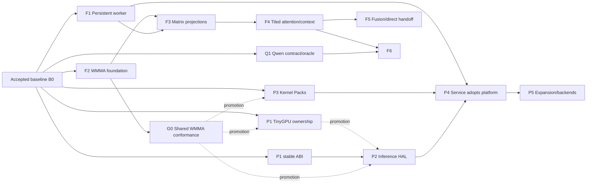

# R9700 Products High-Level Implementation Plan

> This is the approved program-level plan. Executable supervisor/swarm packets now live in [`docs/tasks/r9700-products/`](tasks/r9700-products/README.md); they preserve this plan's workstreams, dependencies, gates, validation ownership, and source references.

**Goal:** Deliver a persistent, high-performance R9700 Prefill Service and a reusable Portable Inference Device Platform without regressing the accepted native Llama producer/cache path.

**Architecture:** Two independent product tracks share TinyGPU device ownership, Kernel Packs, conformance, and evidence. Prefill work continues on the proven AMDev path while TinyGPU and the Inference HAL mature; explicit gates control when the service adopts platform layers. Final decoded tokens remain exact, optimized intermediates use reviewed tolerances, and prompt-cache files remain the durable control even after direct local handoff.

**Technology:** C++17 native runtime and kernels, gfx1201 AMDHSA code objects, TinyGPU/PCIDriverKit, Python 3.12 orchestration and mlx-lm adapters, NumPy/MLX scalar controls, pytest contracts, direct `xcrun clang++` builds, safetensors prompt caches, local stdio/Unix-socket control, and later reviewed shared/pinned memory.

## Global constraints

- Target hardware: AMD Radeon AI PRO R9700, PCI `1002:7551`, RDNA4 `gfx1201`, 32 GB, Apple Silicon macOS over Thunderbolt.
- TinyGPU remains the sole production device owner.
- TinyGPU source, build, and task authority is the in-repository `tinygpu/` tree on `feature/r9700-products-wave-a`; no external TinyGPU checkout or branch is writable.
- Upstream Tinygrad is read-only Port/Adapt provenance and never an active implementation source.
- The native producer path remains tinygrad-free; tinygrad is a reference/differential oracle only.
- Preserve `S-1` prompt-cache semantics and final-token injection for mlx-lm.
- Producer KV is authoritative until handoff; consumer fallback is legal only before cache acceptance.
- Final decoded tokens remain exact against the consumer baseline.
- CPU/NumPy and scalar/native paths remain controls, not native-performance acceptance.
- Matrix-shaped FP16 projections and tiled attention precede quantized native promotion.
- Qwen research is separate from Llama acceptance.
- No TCP/network exposure before a focused transport/security review.
- No upstream source, translated sequence, firmware, or generated image enters production without manifest provenance, license status, digests, target scope, and local conformance.
- Use `${PY}`; do not rely on `python3` from `PATH`.
- Keep direct `xcrun --sdk macosx clang++ -std=c++17 -O2 -Wall -Wextra` build conventions; do not introduce a build system without a separate decision.

## Authority and starting state

Implementation task documents must cite:

- `CONTEXT.md` for language;
- `docs/ARCHITECTURE.md` for ownership and boundaries;
- `docs/DESIGN.md` for interfaces, numerics, lifecycle, security, and validation;
- `docs/ROADMAP.md` for phase outcomes and promotion gates;
- `docs/REFERENCES.md` and `docs/upstream-reference-manifest.yaml` for source reuse;
- `docs/pinned-upstream-interfaces.md` for exact consumer/runtime interfaces;
- `.superpowers/swarm/progress.md` for current C0/C1R/C2R evidence;
- `docs/tasks/native-r9700-producer/validation-commands.md` for executable command pins.

Starting state B0 is complete: native 16-layer Llama prefill, C1R token parity through prompt-128, C2R accepted hardware-producer route with no fallback, scalar/native controls, prompt-cache emission, hardware evidence binding, code-image admission, resident allocations, and profiling.

## Program execution model

The first tranche produced F1 promotion plus partial F2/P1/P3/Q1 foundations. Continuing execution uses the task-set waves below rather than treating whole phases as simultaneously runnable.

### Wave B0 — immediate independent unblockers

Five lanes are ready now:

1. **F2 task set 3A:** materialize pinned rocWMMA/AITER sources and select one candidate gfx1201 image.
2. **P1 task set 1A:** re-freeze the infeasible import transport through security/architecture review.
3. **P1 task set 2A:** bind cold-firmware revisions, hashes, licenses, ASIC/IP scope, and bundle policy.
4. **Q1 task set 7:** close immutable base revision and license provenance.
5. **P2 task set 1:** freeze the portable HAL against the accepted stable P1 subset, explicitly deferring import/device-local/private-VM operations.

The five reports/source-input sets may develop concurrently. One P1↔P2 contract owner serializes edits to both phase packets and the active validation ledger. One upstream-manifest owner serializes F2/P1/Q1 provenance changes after each lane's disjoint report is ready. No B0 lane runs R9700 hardware.

### Wave B1 — source implementation after local freezes

- F2 task set 3B consumes 3A and binds real ISA/resource/physical-layout evidence. Task set 4 then implements the admitted family; task set 5 may develop the frozen numerical/tail harness beside task set 4. Task set 6 serializes the hardware benchmark and G0 publication.
- P1 task set 2B consumes cold-firmware provenance. Task set 3 resumes import/device-local/private-VM work only after both 1A and 2B.
- P2 task sets 2 and 3A run concurrently after its task-set-1 freeze: portable/mock objects versus the stable host-visible buffer/executable AMD backend.
- Q1 provenance closure remains independent.

### Wave B2 — G0 consumers and backend completion

After G0, F3 projection work and P3's exact G0 Kernel Pack migration run concurrently. P2 task set 3B consumes the amended/accepted P1 import and mapping contract; P2 task set 4 follows 3A/3B. P2 may implement before P1/G0 acceptance but cannot promote without both.

One F2→P3 integration owner serializes shared catalog/generated-asset files. F3 owns projection graph files and consumes F1's already-promoted model-handle/prepacking contract.

### Wave C1 — graph and platform completion

F4 tiled attention, P2 command/queue/fence completion, and P3 final promotion may run concurrently after their direct dependencies. Their source work is disjoint; all R9700 hardware commands serialize through the hardware lock.

### Wave C2 — product/platform convergence

P4 begins production migration only after accepted P2/P3 and the selected F2–F4 graph. F4→P4 handoff uses one graph/runtime/service integration owner; P4 does not race F4 in shared runtime or service evidence files.

### Wave D — downstream measured options

F5 fusion/direct-handoff work may begin after F4. F6 quantized/Qwen work begins only after both F4 and Q1 task set 7; once both prerequisites hold, F5/F6 may investigate concurrently with serialized integration where they touch Kernel Packs, model residency, or Engine Adapters. P5 begins only after P4 and an evidence-selected, human-approved need.

### Parallelism and promotion rules

- Parallelize source/research lanes with disjoint ownership; serialize shared contract/catalog/runtime integration through named owners.
- Serialize every DEXT install and R9700 hardware command, regardless of source-wave concurrency.
- G0 is produced once by F2 and consumed verbatim by P1/P2/P3/F3.
- Promotion gates remain strict: partial/mock/offline work never substitutes for P1 hardware ownership, F2 native WMMA evidence, P3 exact artifact migration, or Q1 provenance.

## Repository and file responsibility map

### Current `egpu` repository

| Responsibility | Primary files | Planned direction |
|---|---|---|
| Native device/runtime control | `native_r9700/amdev_session.*`, `amdev_packets.*`, `device_memory.*`, `dynamic_page_table.*`, `runtime.*`, `runner.cpp` | Preserve as accepted AMD implementation; move behind HAL only at P4. |
| Executable admission | `native_r9700/hsa_code_image_asset.*`, `kernel_assets.*`, `kernel_catalog.*` | Evolve into concrete Kernel Pack validation/selection; no runtime YAML parser. |
| Resident model state | `resident_memory.*`, `vram_layout.*`, `vram_allocator.*`, `model_weight_binder.*` | Bind to model-handle lifetime, prepacking, scratch, and reusable buffers. |
| Llama graph/control | `llama_layer_executor.*`, `llama_stage_layout.*`, `kernels/llama_*` | Retain scalar graph as control; add WMMA/attention families without hiding old/new selection. |
| Service and adapters | `native_worker.py`, `serving.py`, `kv_cache.py`, `parity.py`, `benchmark.py` | Split persistent model/process ownership from consumer adapter behavior; preserve fail-closed semantics. |
| Qwen research | `qwen_*`, Qwen fixtures/tests | Complete Q1 contract/oracle work; no native promotion before F6. |
| Validation | `tests/native_r9700/`, hardware logs, validation ledger | Add focused behavioral contracts and hardware promotion records per phase. |

New focused modules are justified only at clear ownership boundaries:

- `native_r9700/model_service.py` — persistent model registry, handle lifecycle, draining, and resource ownership.
- `native_r9700/service_protocol.py` — versioned local request/response schema and redaction rules.
- `native_r9700/hal.h` / `hal.cpp` — portable object and command semantics.
- `native_r9700/hal_amdev.h` / `hal_amdev.cpp` — AMD/TinyGPU translation using accepted AMDev code.
- `native_r9700/kernel_pack.h` / `kernel_pack.cpp` — concrete runtime pack identity, compatibility, and evidence binding over existing assets/catalogs.

Do not create these modules as scaffolds. Each appears only in the task set that delivers working behavior and focused tests.

### In-repository TinyGPU product source

`tinygpu/` is the sole writable TinyGPU source, build, and task authority on branch `feature/r9700-products-wave-a`. Upstream Tinygrad remains read-only Port/Adapt provenance only. Device-owner work belongs in this in-repository TinyGPU DEXT source, not a separate checkout or new DEXT:

- `tinygpu/TinyGPUDriverExtension/`
- `tinygpu/Conformance/`
- `tinygpu/Shared/`
- `tinygpu/TinyGPUDriverExtension.xcodeproj/`

The products worktree owns phase/task ledgers, validation commands, and accepted inference evidence. `tinygpu/` owns DriverKit lifecycle, resource, user-client, conformance-client, packaging, and security behavior. All TinyGPU Xcode/build/install commands run from `tinygpu/` and write binaries under `tinygpu/build/`; in-repository task documents must freeze request/response structures before implementation.

### Read-only/adaptation references

- `lemonade-sdk/mac-amdgpu` for cold-init/IP-block sequences.
- tinygrad AMDev for differential lifecycle/VM/queue behavior.
- Linux amdgpu for normative GFX12 formats and sequences.
- ROCm/AITER/FlashAttention/IREE/PJRT/MLX sources according to `REFERENCES.md`.

No execution task modifies a reference checkout unless the task explicitly creates and owns an upstream contribution.

# Fast Prefill implementation stream

## F1 — Persistent warm worker

### Deliverable

A local long-lived process loads a model once, returns an opaque model handle, serves repeated native prefill requests using resident/prepacked weights and reusable buffers, emits validated prompt caches, and unloads cleanly.

### Change surface

- Create `native_r9700/model_service.py` and `native_r9700/service_protocol.py` with real load/prefill/unload behavior in the same change that introduces them.
- Modify `native_r9700/native_worker.py` to host the process and dispatch protocol operations.
- Keep `native_r9700/serving.py` focused on consumer routing, cache acceptance, fallback-before-acceptance, and decode.
- Extend `resident_memory.*`, `model_weight_binder.*`, and `runtime.*` only where model-handle lifetime requires native ownership.
- Extend `benchmark.py` to write distinct cold, warm, and GPU-compute records.
- Add focused model-lifecycle, repeated-request, crash-cleanup, redaction, and benchmark-scope tests under `tests/native_r9700/`.

### Work packages

1. Freeze local protocol version, request IDs, model fingerprint fields, status/error domains, and evidence payload.
2. Introduce model registry states: validating, preparing, resident-ready, draining, and unloaded.
3. Bind native resident allocations, weight preparation, executable identity, scratch, and reusable request buffers to one handle.
4. Route repeated prefill through the handle without model/weight reload.
5. Preserve prompt-cache atomicity, hardware-evidence validation, and consumer acceptance semantics.
6. Add cold/warm/GPU-compute benchmark capture and run the persistent-process smoke.

### Validation and cutover

- Focused Python contracts first; then native suite.
- Actual process smoke: load → at least ten prompt-128 prefills → unload → reload.
- Hardware evidence must show no weight reload between warm requests and no resource drift.
- Keep the existing one-shot path as a diagnostic control during F1; remove it as a production route when the persistent route passes and all callers migrate.

### Required references

Local worker/serving/resident code, mlx-lm cache pins, oMLX worker lifecycle, and vLLM connector only as protocol pattern.

## F2 — gfx1201 WMMA foundation

### Deliverable

An independently admitted and measured gfx1201 FP16 WMMA linear family executes through the current code-image loader and becomes available to the model graph.

### Change surface

- Add a local lane/register-map proof source under `native_r9700/kernels/` and its generated HSA asset directory.
- Add `native_r9700/kernels/linear_wmma_f16.cpp` with the first declared Llama shape family and tails.
- Extend `hsa_code_image_asset.*`, `kernel_assets.*`, and `kernel_catalog.*` only for concrete WMMA metadata/selection needs.
- Add standalone numerical, descriptor, ISA-category, tail, and performance contracts under `tests/native_r9700/`.

### Work packages

1. Freeze expected gfx1201 lane/register layout, family ABI, numerical policy, ownership, and commands.
2. Execute the independent lane-map proof.
3. Materialize exact pinned rocWMMA/AITER sources, complete file-level license review, and select one candidate image with source/build digest.
4. Bind the real image's ISA, descriptors, resources, and physical layout through offline admission.
5. Implement the first WMMA family while developing its frozen full-tile/tail numerical harness.
6. Run native numerical/performance evidence and publish the immutable G0 record/catalog family without model selection.

### Validation and cutover

- Offline ISA/resource analysis and real-hardware execution are both required.
- The scalar kernel remains available as control.
- No model graph selection changes until standalone correctness and matrix-utilization evidence pass.

### Required references

LLVM AMDGPU Usage, IsaDecoder, RGA, matrix calculator, rocWMMA samples, and component-specific license review in the manifest.

## F3 — Matrix projection graph

### Deliverable

Gate/up, down, fused QKV, and O projection stages use admitted WMMA families in profile order, with model-load prepacking and a validated B16–B128 ladder.

### Change surface

- Add shape-specific sources/assets under `native_r9700/kernels/` rather than one unconstrained generic kernel.
- Modify `llama_layer_executor.*`, `llama_stage_layout.*`, and `model_weight_binder.*` for packed-weight identity and graph selection.
- Extend kernel catalog/asset records with shape, packing, epilogue, and numerical policy.
- Extend stage oracle and parity tests for every replacement boundary.

### Work packages

1. Promote gate/up with one physical packed projection and shared activation tile.
2. Promote down projection.
3. Promote fused QKV where geometry and layout permit one activation stream.
4. Promote O projection; fuse residual only if measured.
5. Re-run B4/B16/B32/B64/B128 after matrix families exist.
6. Select the smallest warm-winning production set; retain rejected variants as benchmark records, not runtime branches.

### Validation and cutover

Each stage moves independently after standalone, graph numerical, final-token, and warm-performance gates. A stage reverts to the scalar control if it fails; accepted sibling stages remain enabled. After the full graph passes, remove obsolete production selection paths rather than carrying compatibility aliases.

## F4 — Tiled attention and context expansion

### Deliverable

A causal online-softmax attention family replaces score/probability materialization and supports chunked 512/2K/4K prefill.

### Change surface

- Add `native_r9700/kernels/llama_flash_attention_gfx1201.cpp` and generated assets with explicit Llama GQA/head-dim families.
- Modify `llama_layer_executor.*` and stage layout for tiled Q/K/V access and chunk recurrence.
- Extend K/V layout metadata only if a versioned transform is required.
- Add causal-boundary, tail, prefix/live-length, GQA, recurrence, long-context, numerical-stability, and memory-footprint tests.

### Work packages

1. Port/adapt the pinned AITER gfx1201 algorithm and validate file-level licensing.
2. Implement online max/sum and causal masking against scalar/MLX references.
3. Bind four query heads to each Llama K/V head and validate every mapping boundary.
4. Remove full score/probability VRAM scratch from the promoted path.
5. Add persistent-prefix chunk recurrence at 128/256-token chunks.
6. Promote context gates independently: 512, then 2K, then 4K.

### Validation and cutover

Prompt-128 parity is necessary but insufficient. Each context gate needs long-run finite-state, exact-token, recurrence, memory, and warm evidence. Keep scalar attention as control until all supported contexts pass.

## F5 — Measured fusion and direct local handoff

### Deliverable

Measured elementwise/launch overhead is fused, and a reviewed direct-local KV adapter avoids unnecessary file rewriting while preserving the prompt-cache control.

### Change surface

- Add only profile-justified fused kernel entry points.
- Keep canonical KV and cache validation in `kv_cache.py`/`serving.py`; isolate any direct-memory adapter in a focused module rather than branching the file format logic.
- Extend protocol and model service with opaque buffer-handoff metadata and ownership.
- Add stale-handle, bounds, producer crash, consumer rejection, post-acceptance failure, and file/direct equivalence tests.

### Work packages

1. Reprofile the matrix/attention graph and select only dominant residual overhead.
2. Admit fused norm/activation/residual entry points with independent numerical policies.
3. Freeze direct-local ownership, lifetime, bounds, and evidence fields.
4. Implement file and direct adapters over one canonical KV validator.
5. Compare warm latency and copies; direct mode promotes only with material measured benefit.
6. Retain prompt-cache export for compatibility, replay, and review.

### Validation and cutover

No direct adapter becomes mandatory. File mode remains an always-available control. Fail closed after cache acceptance in both modes.

## F6 — Quantized kernels and model promotion

### Deliverable

The matrix/attention architecture supports evidence-selected quantized families and promotes the first Qwen native path using its own cache/model contract.

### Change surface

- Extend Kernel Pack shape/dtype/packing records for INT8/INT4 and selected model geometries.
- Reuse Q1 loader/cache/oracle modules; add native kernels only after shared family review.
- Extend resident/staging policy for measured 32 GB pressure.
- Add Qwen-specific parity, recurrence, cache, quantization, memory, and hardware-evidence tests.

### Work packages

1. Choose weight-only family from measured model/residency needs.
2. Admit standalone quantized GEMM with exact packing/scales and scalar/MLX reference.
3. Integrate Qwen graph/state families without Llama geometry assumptions.
4. Bind hybrid cache and recurrence to canonical metadata and engine adapter.
5. Run native Qwen correctness/stability before throughput promotion.
6. Promote larger models only with warm/residency evidence.

# Portable Device Platform implementation stream

## P1 — Harden TinyGPU device ownership

### Deliverable

TinyGPU cold-initializes and safely owns R9700 buffers, VA, queues, executable submission, fences, faults, reset, and per-client cleanup through a versioned user-client boundary.

### Change surface

- Modify the TinyGPU DEXT files listed in the repository map.
- Add matching versioned client structures to the existing shared TinyGPU boundary rather than exposing `egpu` C++ internals.
- Add conformance client coverage in this repository around `amdev_session.*`, `runtime_contract.cpp`, and focused pytest compile/run contracts.
- Translate only reviewed mac-amdgpu/tinygrad/Linux sequences.

### Work packages

1. Preserve the accepted stable ABI/security/role boundary and re-freeze the infeasible import transport through a focused amendment.
2. Bind every required cold-firmware input to revision, SHA-256, WHENCE/license, ASIC/IP scope, and approved DEXT bundle/load policy.
3. Complete cold lifecycle ownership and differential register/evidence capture without accepting pre-warmed state.
4. Complete import, device-local/private-VM, and queue ownership with client-death reclamation.
5. Add validated executable/command submission, fences, timestamps, faults, queue/device reset, and recovery.
6. Run fresh power-on → BO/VM → SDMA → constant-store → G0 WMMA → sustained inference.

### Validation and cutover

The existing accepted warm path remains available while cold-init/hardened APIs develop. P1 may start beside F2, but TinyGPU promotes only after it consumes the shared G0 WMMA conformance record plus cold and recovery evidence; mac-amdgpu never becomes an automatic fallback owner.

## P2 — Inference HAL and AMD backend

### Deliverable

Portable Device/Buffer/Executable/CommandBuffer/Queue/Fence semantics execute over the stable TinyGPU boundary.

### Change surface

- Create `hal.h`, `hal.cpp`, `hal_amdev.h`, and `hal_amdev.cpp` only with working copy/fill/dispatch/barrier/timestamp/fence/fault behavior.
- Reuse `amdev_session.*` behind `hal_amdev`; do not duplicate packet/queue implementations.
- Add compile-time interface checks and real behavioral conformance tests.

### Work packages

1. Freeze the portable ABI now against the accepted stable P1 subset, with a separate deferred import/device-local/private-VM operation matrix.
2. Implement portable objects/mock conformance and the stable AMD host-visible buffer/executable backend in parallel.
3. Extend the AMD backend with import/device-local/private-VM semantics only after P1 accepts them.
4. Implement command recording, validated submit, wait/signal fences, timestamps, timeout, fault, and reset observation.
5. Run direct/HAL copy/fill/constant-store/G0 WMMA/barrier/error equivalence after P1/G0 acceptance.
6. Remove every AMD packet/register type from portable headers; P4 alone owns service migration.

### Validation and cutover

P2 does not move the prefill service. It first proves direct AMDev versus HAL output/evidence equivalence and consumes the shared G0 WMMA record rather than creating a HAL-specific substitute. P4 owns production migration.

## P3 — Kernel Pack system

### Deliverable

Every production executable is admitted and selected through concrete source/image, target, descriptor, shape, numerical, provenance, license, conformance, and benchmark records.

### Change surface

- Create `kernel_pack.h`/`kernel_pack.cpp` over existing `hsa_code_image_asset` and catalog structures.
- Extend generated assets/catalogs with concrete compile-time records; do not parse `docs/upstream-reference-manifest.yaml` at runtime.
- Add an offline validation command using pinned ISA/RGA tooling where available.
- Add rejection tests for malformed target, descriptors, resources, digests, shapes, and numerical policy.

### Work packages

1. Freeze pack identity and compatibility fields from `DESIGN.md`.
2. Migrate scalar control assets without behavioral change.
3. Migrate F2 WMMA assets and bind external provenance.
4. Add offline ISA/resource report ingestion or linkage.
5. Make runtime selection depend on declared compatibility and evidence.
6. Define upstream refresh review with file-level license and conformance rerun.

### Validation and cutover

An executable without a concrete pack record remains diagnostic-only. P3 may start beside F2, but it promotes only after the exact G0 WMMA record migrates into the pack system. Runtime loading rejects unknown or contradictory metadata before allocation/submission.

## P4 — Service adopts HAL and Kernel Packs

### Deliverable

The persistent prefill service runs through P2/P3 with non-regressing correctness, warm performance, diagnostics, and cleanup.

### Change surface

- Bind model handles to HAL Device/Buffer/Executable/Queue/Fence objects.
- Replace direct graph submission in `llama_layer_executor.*`/runtime integration with portable command buffers.
- Extend service evidence with TinyGPU ABI, HAL backend, Kernel Pack, model, and adapter identities.
- Migrate all production callers before removing the direct production path.

### Work packages

1. Run F1 service on direct and HAL paths from one immutable model/kernel set.
2. Compare C1R/C2R, repeated warm requests, timings, transfers, dispatches, faults, and cleanup.
3. Fix platform overhead at the HAL/backend boundary rather than leaking AMD details upward.
4. Exercise timeout/reset/client death and model unload through service ownership.
5. Select HAL production path only after the P4 gate.
6. Perform clean cutover; retain direct path solely as explicit diagnostic control or remove it.

## P5 — Capability and engine expansion

### Deliverable

One evidence-selected second workload/device/engine demonstrates platform reuse, or the phase records that no expansion is justified.

### Candidate order

1. Qwen service workload on the same R9700, if F6 is ready.
2. ggml/llama.cpp backend experiment through `ggml-backend.h`.
3. Another AMD target through a capability manifest and target Kernel Packs.
4. Native MLX AMD backend only after a measured adapter limitation and new ADR.

Promotion requires a usable inference outcome and the full relevant conformance class; interface breadth alone does not pass.

# Parallel Qwen research stream

## Q1 — Contract and oracle package

### Deliverable

Qwen3.8-27B has deterministic loader, model fingerprint, quantization, MLX-VLM boundary, hybrid-cache state, recurrence, adapter, fixture, and CPU/MLX oracle contracts ready for F6 task planning.

### Change surface

Use and tighten existing `qwen_*` modules and Qwen tests. Do not add R9700-native labels or performance claims. Split modules only when one file owns multiple independent state machines or cache formats.

### Work packages

1. Preserve the accepted model/config/tensor identity, quantized interpretation, hybrid-cache ownership, recurrence, fixtures, shape map, and F6 corpus.
2. Resolve the immutable base-model revision through source-verified evidence; never infer a commit from conversion output.
3. Bind the applicable base-model license, source scope, and redistribution conditions.
4. Update the source pin/model fingerprint only if verified identity changes, regenerating fixtures only when required.
5. Rerun source-pin, tensor, hybrid-state, oracle parity, and package-review gates.
6. Keep all Q1 artifacts labeled `cpu_reference` or oracle-only; native work remains F6.

# Integration and review gates

## G0 — Shared gfx1201 WMMA conformance

Owner: F2. Artifact: one admitted gfx1201 WMMA record binding lane/register mapping, target and code-image identity, descriptors/resources, full-tile and tail numerics, ISA analysis, and hardware performance. P1, P2, and P3 consume this record for promotion; a replacement must be reviewed and published by F2 rather than recreated inside a platform phase.

## G1 — HAL adoption

Owner: P4. Inputs: F1, P2, P3, and the currently selected F2–F4 kernels. Evidence: exact product behavior, warm non-regression, faults, cleanup, and complete Kernel Pack binding. Rejection leaves the service on direct AMDev while platform work continues.

## G2 — Direct KV handoff

Owner: F5. Inputs: F1 persistent lifetime and canonical KV validator. Evidence: file/direct equivalence, ownership/bounds/lifetime security, crash behavior, and material warm benefit. Rejection leaves prompt-cache files as production transport.

## G3 — Native engine backend

Owner: P5. Inputs: P4/F5 production measurements. A new ADR must show a bottleneck that cache/provider adapters cannot solve. Rejection leaves the service/adapter product unchanged.

# Validation strategy

## Per-change contract

- Bug fixes and new observable behavior start with a focused failing pytest/native contract.
- Run the narrow test, then `tests/native_r9700 -v`, then full `tests -v` when the change affects shared runtime/cache/serving behavior.
- Native source changes use the direct `xcrun clang++` build shape from the validation ledger.
- Hardware promotion requires a fresh log with R9700 identity, exact executable/model evidence, failure stage, and `exit_status: 0`.
- Performance promotion exercises the actual worker/kernel surface, not only a test binary.

## Stable regression corpus

- C0 kernel and transfer proof.
- C1R prompts 0/16/64/128 and future expanded context corpus.
- C2R hardware route, accepted cache, no fallback, and post-acceptance failure behavior.
- Scalar/native and CPU/NumPy controls.
- Prompt-cache round trip and `S-1` final-token injection.
- Malformed metadata, model mismatch, non-finite values, timeout, fault, and cleanup.
- Kernel descriptor/target/resource/digest rejection.
- Cold/warm/GPU-compute benchmark record validation.

## Performance records

Every promoted result records model and Kernel Pack digests, device/TinyGPU/runtime identity, prompt/chunk/block shape, transport, wall/CPU/GPU time, transfer/dispatch/kernel counts where available, warm-up, samples, median/dispersion, correctness, and terminal status. The 100/500/1,000/2,000 tok/s bands remain directional; phase gates are evidence-based, not promises.

# Rollout, rollback, and clean cutover

- F1: one-shot path remains a diagnostic control until all service callers use model handles; no permanent compatibility alias.
- F2–F4: scalar families remain explicit correctness controls; production selection changes per admitted stage/family.
- F5: prompt-cache files remain a durable control after direct transport promotes.
- P1: existing warm TinyGPU path remains while cold/hardened lifecycle develops; no second owner.
- P2: HAL remains conformance-only until P4.
- P4: migrate all production callers, then remove or explicitly quarantine the direct production path.
- F6/Q1: Llama controls remain green and Qwen labels remain separate.
- Any cache accepted by a consumer is never silently repaired through fallback.

# Phase task-document handoff

Create independent task-document sets in this order as capacity permits:

1. F1 Persistent warm worker.
2. F2 gfx1201 WMMA foundation.
3. P1 TinyGPU device ownership.
4. P3 Kernel Pack system.
5. Q1 Qwen contract/oracle package.
6. F3 Matrix projection graph after F1/F2 contracts freeze.
7. P2 Inference HAL after P1 ABI freeze.
8. F4 Tiled attention/context after F3.
9. P4 Service/platform integration after F1/P2/P3.
10. F5 Fusion/direct handoff after F4.
11. F6 Quantized/model promotion after F4/Q1.
12. P5 Expansion/backend decision after P4 and a measured need.

Each task set must reproduce its roadmap outcome, design contracts, exact source pins, owned files/interfaces, RED/GREEN checks, hardware command/evidence, review boundary, and promotion decision. Do not combine independent tracks into one swarm packet or treat a phase boundary as permission to skip its gate.
