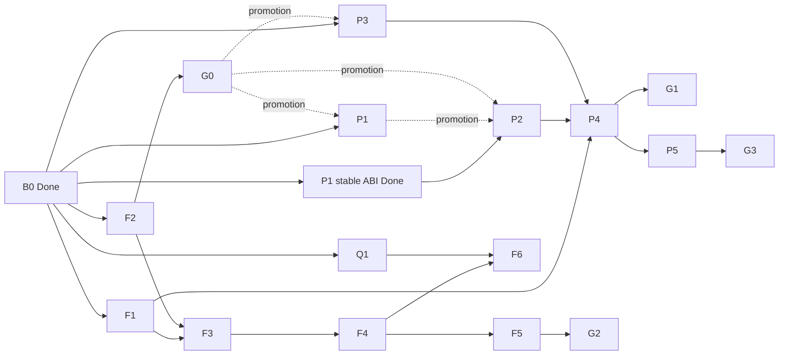

# R9700 Products — Agent Task Set

This directory converts `docs/IMPLEMENTATION_PLAN.md` and `docs/ROADMAP.md` into executable phase packets for supervisor-led swarms. It creates work ledgers only; no phase is executed by these documents.

## Authority

- [`CONTEXT.md`](../../../CONTEXT.md) — canonical language.
- [`docs/ARCHITECTURE.md`](../../ARCHITECTURE.md) — product and ownership boundaries.
- [`docs/DESIGN.md`](../../DESIGN.md) — implementation-facing contracts and gates.
- [`docs/ROADMAP.md`](../../ROADMAP.md) — phase outcomes and promotion order.
- [`docs/IMPLEMENTATION_PLAN.md`](../../IMPLEMENTATION_PLAN.md) — approved workstreams and file surfaces.
- [`docs/REFERENCES.md`](../../REFERENCES.md) and [`upstream-reference-manifest.yaml`](../../upstream-reference-manifest.yaml) — Port/Adapt, Normative, Pattern, Tool, and Watch sources.
- [`validation-commands.md`](../native-r9700-producer/validation-commands.md) — active shared command ledger.
- [`.superpowers/swarm/progress.md`](../../../.superpowers/swarm/progress.md) — current B0 evidence and ready/blocked status.

Archived C0–C3 and Qwen-N1 packets under `docs/archive/` are evidence only. Do not reactivate or edit them in place.

TinyGPU source, build, and task authority is the in-repository `tinygpu/` tree on `feature/r9700-products-wave-a`. Upstream Tinygrad is read-only Port/Adapt provenance only. P1 source edits, Xcode/build/install commands, and conformance-client binaries use `tinygpu/`; no external TinyGPU checkout or branch is an active authority.

## Global execution policy

- A supervisor owns phase status, validation, hardware serialization, review gates, and commits.
- Subagents own only the files and task-set row assigned to them. They do not run project-wide tests, hardware commands, formatters, package managers, or git commands; they report the focused commands the supervisor must run.
- Every behavior change starts with a focused RED contract unless the task is explicitly read-only discovery, source review, or evidence capture.
- Critical/Important review findings block the next task set. Fixes and re-review serialize before promotion.
- Hardware commands serialize through the repository hardware lock and require a fresh `logs/` artifact with R9700 identity and `exit_status: 0` for acceptance claims.
- `cpu_reference` and scalar controls are oracle evidence only. `r9700_native` requires request-bound hardware evidence.
- Preserve the `S-1` prompt-cache/final-token contract and fallback-before-acceptance invariant.
- No network/TCP transport, generic runtime, wholesale upstream dependency, or native engine backend is implied by these packets.
- Agents update only their ledger row and append evidence/notes. They do not reset another row's owner, status, blocker, or evidence.

## Phase ledger

| Phase | Document | Initial status | Promotion dependency |
|---|---|---|---|
| B0 | [`phase-b0-accepted-baseline.md`](phase-b0-accepted-baseline.md) | Done | Preserved regression baseline. |
| F1 | [`phase-f1-persistent-warm-worker.md`](phase-f1-persistent-warm-worker.md) | Not started | B0. |
| F2 | [`phase-f2-gfx1201-wmma-foundation.md`](phase-f2-gfx1201-wmma-foundation.md) | Not started | B0; isolated benchmark or F1 benchmark scope. |
| F3 | [`phase-f3-matrix-projection-graph.md`](phase-f3-matrix-projection-graph.md) | Blocked | F1 model-handle/prepacking contract and F2 WMMA family. |
| F4 | [`phase-f4-tiled-attention-context.md`](phase-f4-tiled-attention-context.md) | Blocked | F3 projection graph. |
| F5 | [`phase-f5-fusion-direct-handoff.md`](phase-f5-fusion-direct-handoff.md) | Blocked | F4 and F1; transport decision/review. |
| F6 | [`phase-f6-quantized-model-promotion.md`](phase-f6-quantized-model-promotion.md) | Blocked | F4, Q1, selected quantized family. |
| P1 | [`phase-p1-tinygpu-device-owner.md`](phase-p1-tinygpu-device-owner.md) | Not started | B0 and ADR 0007; G0 required for promotion. |
| P2 | [`phase-p2-inference-hal.md`](phase-p2-inference-hal.md) | Blocked | P1 ABI freeze; G0 required for promotion. |
| P3 | [`phase-p3-kernel-packs.md`](phase-p3-kernel-packs.md) | Not started | B0; G0 required for promotion. |
| P4 | [`phase-p4-service-platform-adoption.md`](phase-p4-service-platform-adoption.md) | Blocked | F1, P2, P3, selected F2–F4 kernels. |
| P5 | [`phase-p5-capability-engine-expansion.md`](phase-p5-capability-engine-expansion.md) | Blocked | P4 plus evidence-selected candidate and human approval. |
| Q1 | [`phase-q1-qwen-contract-oracle.md`](phase-q1-qwen-contract-oracle.md) | Not started | B0; native work remains downstream of F6. |
| G0–G3 | [`integration-gates.md`](integration-gates.md) | Blocked | Producer phases named by each gate. |

## Orchestration waves

### Wave B0 — immediate parallel unblockers

Dispatch five independent lanes:

- F2 task set 3A: pinned source checkout and candidate image selection.
- P1 task set 1A: import transport ABI re-freeze.
- P1 task set 2A: cold-firmware provenance/bundle policy.
- Q1 task set 7: base revision and license provenance closure.
- P2 task set 1: portable ABI/backend/command freeze against the accepted stable P1 subset.

Ownership constraints:

- F2 owns source/image selection and does not edit generic P3 catalogs.
- P1 1A and 2A may research concurrently, but one P1↔P2 contract owner serializes the P1/P2 packet and validation-ledger edits.
- One upstream-manifest owner serializes F2/P1/Q1 provenance changes after each lane's disjoint report is ready.
- Q1 provenance owns identity/license records only; oracle/cache/parity behavior is immutable.
- P2 task set 1 owns its contract/report inputs and does not create HAL source.
- No B0 lane runs hardware.

### Wave B1 — implementation after local freezes

- F2 task set 3B consumes 3A; task sets 4 and the frozen part of 5 may then overlap. Task set 6 serializes hardware/G0.
- P1 task set 2B consumes 2A; task set 3 waits for both 1A and 2B.
- P2 task sets 2 and 3A run concurrently after task set 1 because they own disjoint portable versus AMD-stable-subset files.
- Q1 task set 7 may continue independently.

### Wave B2 — G0 consumers and backend completion

- F3 and P3 task set 5 start concurrently after accepted G0.
- P2 task set 3B waits for the accepted P1 import/device-local/private-VM contract; task set 4 follows accepted 3A/3B.
- One F2→P3 integration owner serializes `kernel_assets.cpp`, `kernel_catalog.cpp`, and generated catalogs.
- F3 owns projection graph files and consumes F1's promoted model-handle/prepacking contract.

### Wave C1 — graph and platform completion

- F4 tiled attention starts after F3.
- P2 command/queue/fence work and P3 final promotion may proceed beside F4 after their own dependencies.
- Source work may overlap; all DEXT install and R9700 hardware commands serialize through the hardware lock.

### Wave C2 — product/platform convergence

- P4 preparation may begin after P2/P3 contracts, but production migration waits for their acceptance and the selected F2–F4 graph.
- F4 and P4 nominate one owner for shared graph/runtime/service-evidence files; no concurrent edits cross that boundary.

### Wave D — downstream measured options

- F5 may begin after F4.
- F6 may begin only after F4 and Q1 task set 7; once both prerequisites hold, F5/F6 may investigate concurrently with serialized shared integration.
- P5 begins only after P4 and a measured, human-approved need.
- Gates G2/G3 serialize direct-transport or backend ownership decisions.

## Shared contracts and artifacts

| Contract/artifact | Owner | Consumers |
|---|---|---|
| B0 C1R/C2R corpus and scalar/native controls | B0 custodian | Every F/P/Q phase. |
| Model fingerprint and model-handle lifecycle | F1 | F3, P4, F6. |
| G0 WMMA conformance record | F2 | P1, P2, P3, F3. |
| Kernel Pack identity/compatibility schema | P3 | F2–F6, P4/P5. |
| Canonical KV Description and cache acceptance state | F1/F5 adapter owner | F5, F6, P4/P5. |
| TinyGPU user-client ABI | P1 | P2, P4. |
| Inference HAL object/command semantics | P2 | P4, P5. |
| Qwen model/hybrid-cache contract and oracle fixtures | Q1 | F6. |
| Active exact command ledger | Supervisor | Every phase and gate. |

## Reference-use rule

Each phase lists concrete resources from `docs/REFERENCES.md` and manifest IDs. Roles are binding:

- **Port/Adapt:** translate a narrow sequence/algorithm after license and provenance review.
- **Normative:** source defines the ABI, format, or hardware semantics.
- **Pattern:** copy boundary/test shape, not dependency graph.
- **Tool:** generate or validate evidence.
- **Watch:** no current dependency.

An executor must not promote a Pattern or Watch source to Port/Adapt without updating `docs/REFERENCES.md` and `upstream-reference-manifest.yaml`.

## Human decisions and external blockers

- P1 distribution requires the current DriverKit entitlement/signing path to be recorded before product distribution; development conformance may proceed first.
- F5 direct transport selects shared memory versus pinned-host handoff only after a security/lifetime decision task.
- F6 chooses the first quantized family from measured residency/model needs; task packets do not assume INT4 versus INT8 in advance.
- P5 requires a human-approved second workload/device/engine after the evidence decision. No prototype is automatically authorized.
- G3 requires a new ADR before a native engine backend changes ownership or demotes the prompt-cache fast path.
